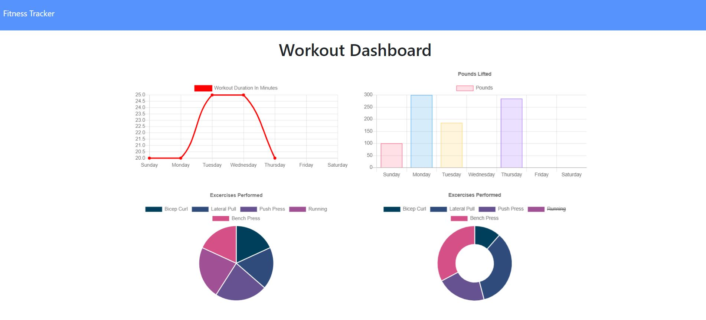

# Workout Tracker
UCI Boot Camp Homework 17 - Workout Tracker

Click [here](https://workout-tracker-maxx.herokuapp.com/) to open deployed Heroku application.

## Description 
 This was the seventeenth homework assignment for the full stack web development program at UC Irvine, in which the goal was to build a full stack application that allows the user to keep track of their workouts. The user can create new workouts, update existing workouts, and view a dashboard that shows a few different charts displaying their data. The front end was given and it was my task to build the backend using Mongoose.

## Table of Contents 
* [Technologies](#Technologies)
* [Usage](#Usage)
* [License](#License)
* [Badges](#Badges)
* [Tests](#Tests)
* [Questions](#Questions)

## Technologies 
* This application is written in Javascript and uses MongoDB for creating, reading, and updating data from a database.
* It uses CSS for styling.
* This application uses the Mongoose ORM for MongoDB and Express for handling routes. 
* It requires node.js to run it.

## Usage 
If using from the Heroku deployed application, just go to the deployed application's [link](https://workout-tracker-maxx.herokuapp.com/). Start by clicking 'New Workout' to create a workout. You can choose between 'Cardio' or 'Resistance' and you can then fill in the necessary information for that workout. Once you submit it, you can go back to the home page by clicking 'Fitness Tracker' in the upper left. You can either create a new workout, click 'Continue Workout' which will allow you to edit the last workout (which is displayed on the home page), OR you can click 'Dashboard' in the upper left corner which will bring you to stats page which shows various charts to display your first 5 workouts. If running off a local server, first do an npm install then run the server by running the "node server.js" command in a gitbash terminal. Then navigate to a browser and go to http://localhost:3000/ to render it.

## License 
 ISC

## Badges 
 
 

## Tests 
 No tests are currently in place for this project.

## Questions 
 For any questions, contact me at [maxxsanner105@gmail.com](mailto:maxxsanner105@gmail.com).
#### 

